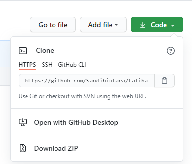
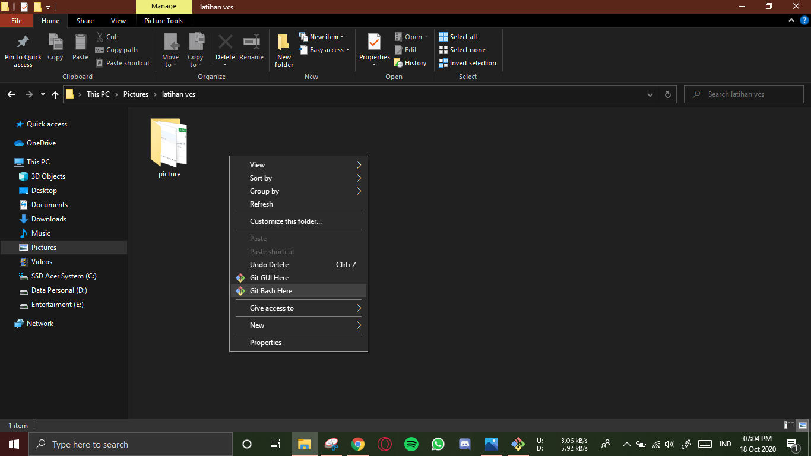
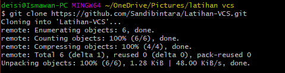

# Latihan-VCS
Repository ini dibuat untuk memenuhi tugas pertemuan 4 - matakuliah bahasa pemrograman
--------------------------------------------------------------------------------------

Nama		: Sandi Bintara

Nim		: 310210039

Mata Kuliah	: Bahasa Pemrograman

--------------------------------------------------------------------------------------

## Langkah-langkah Penggunaan git
### 1. Download git sesuai dengan spesifikasi laptop atau computer anda [*click here](https://git-scm.com/) lalu instal.

### 2. Check Versi git kalian dengan langkah berikut :

 > git --version

### 3. Masukan Author pembuat git (anda) dengan langkah berikut :

* hasil sebagai berikut :

### 4. Membuat respository di github [*click here](github.com)
*NB. Buatlah account github terlebih dahulu!

* Jika sudah login klik pojok kanan atas

* isi semua form sesuai project yang akan anda buat

* lalu click create!

`hasil Repository :`

### 5. Clone Repository ke dalam folder yang sudah di buat di file Explorer and

* Copy link repository yang telah di buat

* buka git bash di file explorer yang sudah di siapkan untuk membuat project baru

* lalu clone
> git clone "link"

### 6. Cd file
> Cd nama file

