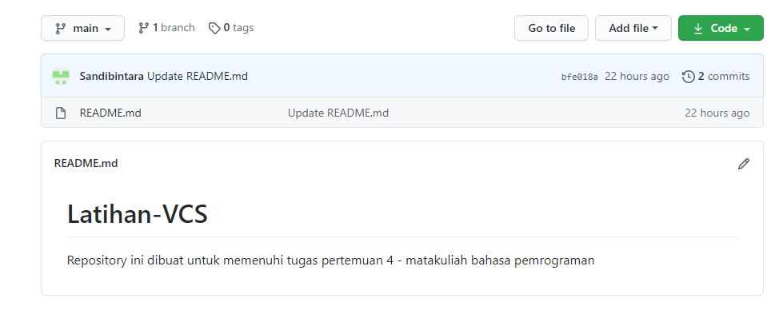

# Latihan-VCS
Repository ini dibuat untuk memenuhi tugas pertemuan 4 - matakuliah bahasa pemrograman
--------------------------------------------------------------------------------------

Nama		: Sandi Bintara

Nim		: 310210039

Mata Kuliah	: Bahasa Pemrograman

--------------------------------------------------------------------------------------

## Langkah-langkah Penggunaan git
### 1. Download git sesuai dengan spesifikasi laptop atau computer anda [*click here](https://git-scm.com/) lalu instal.
  

  
### 2. Check Versi git kalian dengan langkah berikut :
  

  
### 3. Masukan Author pembuat git (anda) dengan langkah berikut :
  

 hasil sebagai berikut :

  
### 4. Membuat respository di github [*click here](github.com)
  NB. Buatlah account github terlebih dahulu! 

  

  

  
hasil Repository :
  

  
### 5. Clone Repository ke dalam folder yang sudah di buat di file Explorer and

